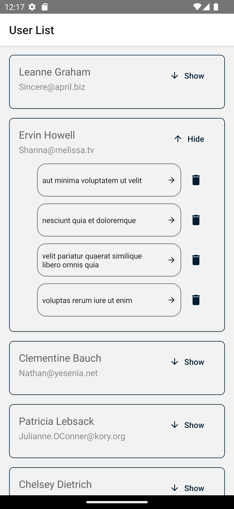
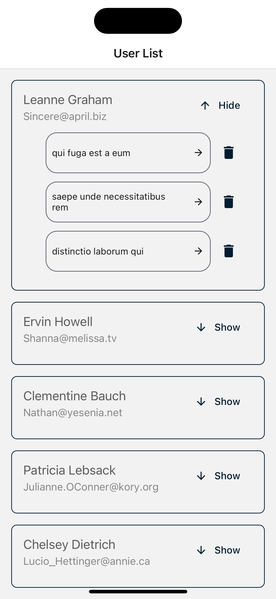

# BSW React Native

react-native applicaion demo with redux

## Table of Contents

- [Features](#features)
- [installation](#installation)
- [Folder Structure](#folder-structure)
- [Dependencies](#project-dependencies)
- [Dependencies](#screen-shot)

## Features

- Listing users using fetch api
- Listing User albums
- Album deletion
- View albums photos
- View all photos

## Installation

```bash
   git clone https://github.com/bsw-mobile-react-navtive.git
   cd yourproject
   npm install 
```

## Folder structure
    |-- src/
        |-- assets 
        |-- components
        |-- config
        |-- constants
        |-- localization
        |-- model  
        |-- navigation
        |-- screens
        |-- services
        |-- store
        |-- theme
        |-- utils
    App.tsx

## Project Dependencies

This project relies on the following key dependencies

- **@react-native-async-storage/async-storage:** Storage to persist usera album data  

- **axios:** HTTP client for making API requests.

- **redux:** State management

## Screen-shot 
### Android & iOS
<p float="left">
  
  
</p>